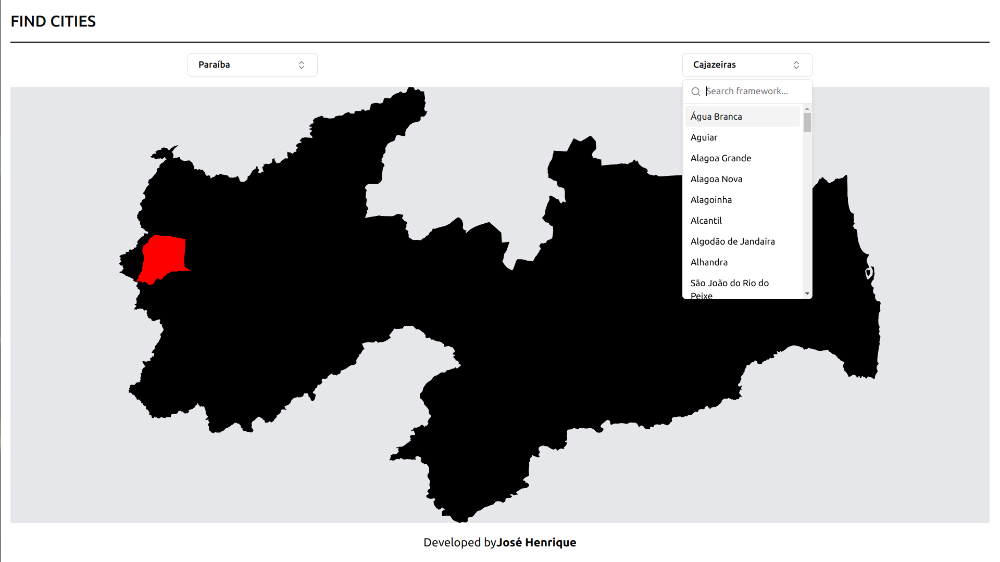

# Find-Cities



> O Find-Cities mostra o mapa de um municipio brasileiro dentro do seu estado. Logo o usuário pode visualizar em que lugar fica sua cidade em relação ao estado. 


## 🚀 Instalando API 

Na pasta ```/api```, siga estas etapas:

1. Crie um arquivo .env com base no arquivo .env.example e preencha as informações.
2. Abra o terminal e instale as dependencias com: ```npm i```

## 🚀 Instalando SPA

Na pasta ```/spa```, siga estas etapas:

1. Abra o terminal e instale as dependencias com: ```npm i```


## ☕ Usando Find-Cities

Para usar o Find-Cities, siga estas etapas nas pastas /api e /spa:

```
npm run dev
```


## 🤝 Colaboradores


<table>
  <tr>
    <td align="center">
      <a href="#">
        <br>
        <sub>
          <b>José Henrique</b>
        </sub>
      </a>
    </td>
  </tr>
</table>
